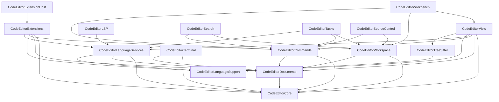

# API audit — modular product inventory

Baseline: **main** after Phase 12 (`3d5f122` lineage). Isolation: `scripts/check-product-isolation.sh`.

## Product inventory

| Product | Stability | Purpose | Key entry types | Deps (allowlist) | Tests | ADR / Notes |
|---|---|---|---|---|---|---|
| CodeEditorCore | Stable | Buffer, versions, selection, undo, formation | `DocumentStore`, `DocumentVersion`, `EditTransaction`, `SelectionEngine` | TextStory | CodeEditorCoreTests | ADR-001, 002 |
| CodeEditorDocuments | Stable | Shared `TextDocument`, sessions, URI | `TextDocument`, `DocumentURI`, `EditorSession` | Core | CodeEditorDocumentsTests | ADR-003 |
| CodeEditorLanguageSupport | Stable | Language IDs, registry, highlight contracts | `LanguageID`, `LanguageRegistry`, `HighlightProviding` | — | CodeEditorLanguageSupportTests | ADR-001 |
| CodeEditorTreeSitter | Stable | Tree-sitter provider (no grammars) | `TreeSitterHighlightProvider` | LanguageSupport, SwiftTreeSitter | (via View/Languages) | ADR-001 |
| CodeEditorView | Stable | Editor UI + controller | `CodeEditor`, `EditorController` | Core, Documents, Commands, LanguageServices, LanguageSupport, TreeSitter | CodeEditorViewTests | — |
| CodeEditorLanguageSwift | Stable* | Swift pack | `register()` | LanguageSupport, TreeSitter, grammar | (Languages tests) | TRANCHE1 |
| CodeEditorLanguageJSON | Stable* | JSON pack | `register()` | same | same | TRANCHE1 |
| CodeEditorLanguages | Stable* | All packs + bootstrap | `bootstrap()` | all grammars | CodeEditorLanguagesTests | TRANCHE1 |
| CodeEditorCommands | Evolving | Commands, keybindings, palette model | `CommandRegistry`, `KeybindingRegistry` | Core, Documents | CodeEditorCommandsTests | ADR-004 |
| CodeEditorWorkspace | Evolving | Multi-root workspace, edits | `Workspace`, `WorkspaceEditService` | Core, Documents | CodeEditorWorkspaceTests | ADR-005 |
| CodeEditorWorkbench | Evolving | SwiftUI shell | `WorkbenchView`, `WorkbenchModel` | View, Workspace, Commands, … | CodeEditorWorkbenchTests | ADR-006 |
| CodeEditorLanguageServices | Evolving | Provider contracts + host | `LanguageServiceHost`, `CompletionProvider` | Core, Documents, LanguageSupport | CodeEditorLanguageServicesTests | ADR-007 |
| CodeEditorSearch | Evolving | Workspace search/replace | `WorkspaceSearchService`, `SearchReplaceBuilder` | Core, Documents, Commands, Workspace | CodeEditorSearchTests | ADR-010 |
| CodeEditorTasks | Evolving | Tasks, matchers | `TaskService`, `ProblemMatcher` | + LanguageServices | CodeEditorTasksTests | ADR-010 |
| CodeEditorExtensions | Experimental | In-process extensions | `ExtensionRuntime`, `CodeEditorExtension` | Core, Documents, Commands, LanguageSupport, LanguageServices | CodeEditorExtensionsTests | ADR-008 |
| CodeEditorExtensionHost | Experimental | Out-of-process host | `RemoteExtensionHost` | Extensions + … | CodeEditorExtensionHostTests | ADR-011 |
| CodeEditorLSP | Experimental | LSP client | `LanguageServerPool`, `LSPDocumentSynchronizer` | Core, Documents, LanguageSupport, LanguageServices | CodeEditorLSPTests | ADR-009 |
| CodeEditorTerminal | Experimental | Terminal backend | `TerminalSessionManager` | Core, Documents | CodeEditorTerminalTests | ADR-010 |
| CodeEditorSourceControl | Experimental | SCM providers | `SourceControlService`, `GitCLIProvider` | Core, Documents, Commands, Workspace | CodeEditorSourceControlTests | ADR-010 |

\* Language pack **public registration API** is Stable; grammar/query content is not versioned as API.

## Dependency graph (products)



## Isolation

Run:

```bash
scripts/check-product-isolation.sh
```

## Related

- [API stability](API-STABILITY.md)
- [Product selection](PRODUCT-SELECTION.md)
